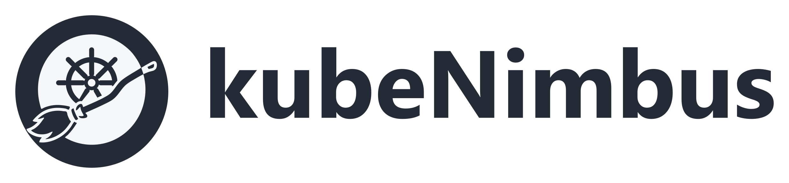
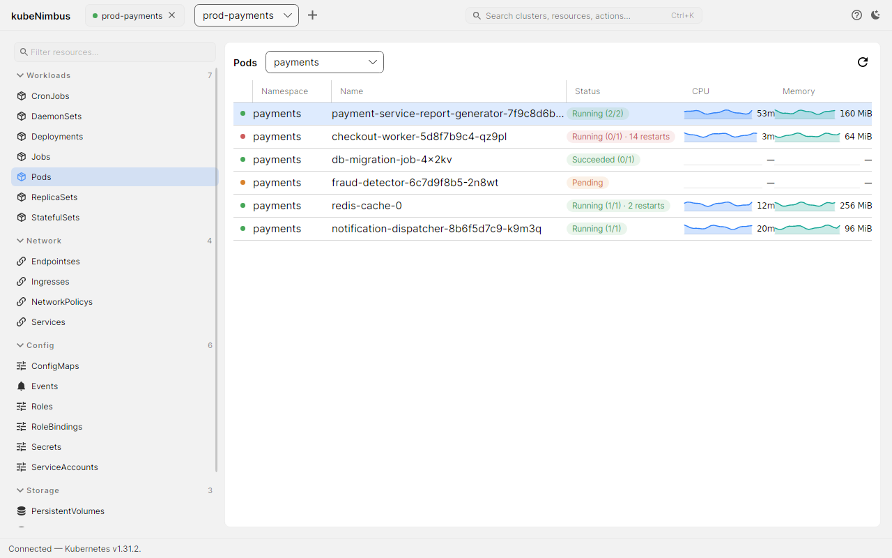
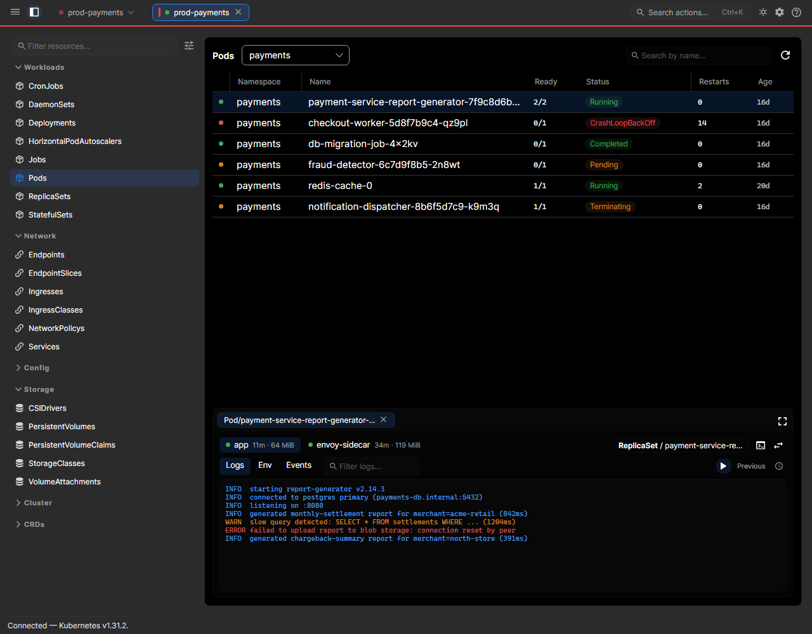
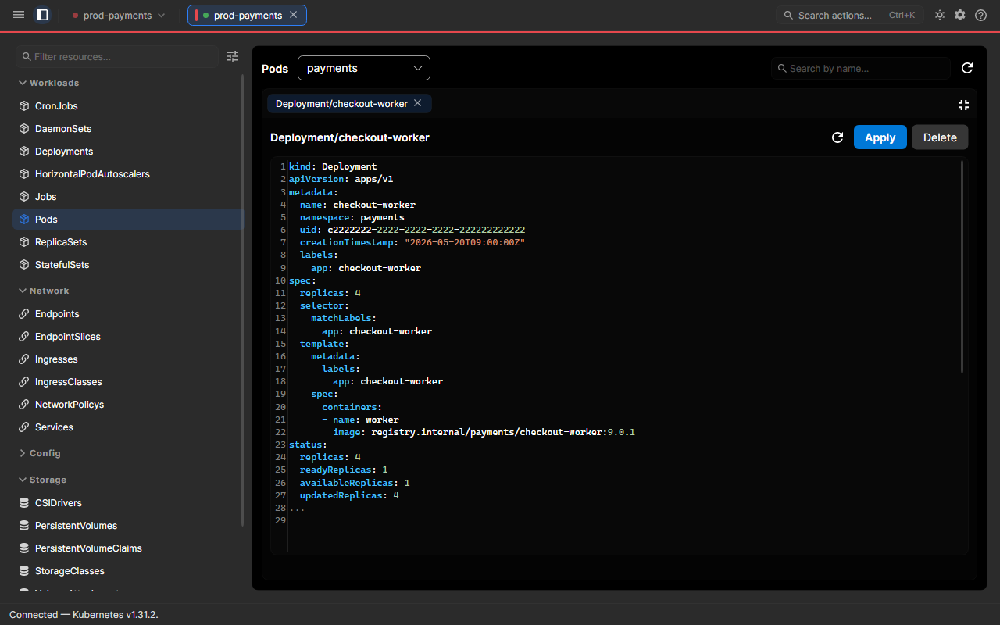
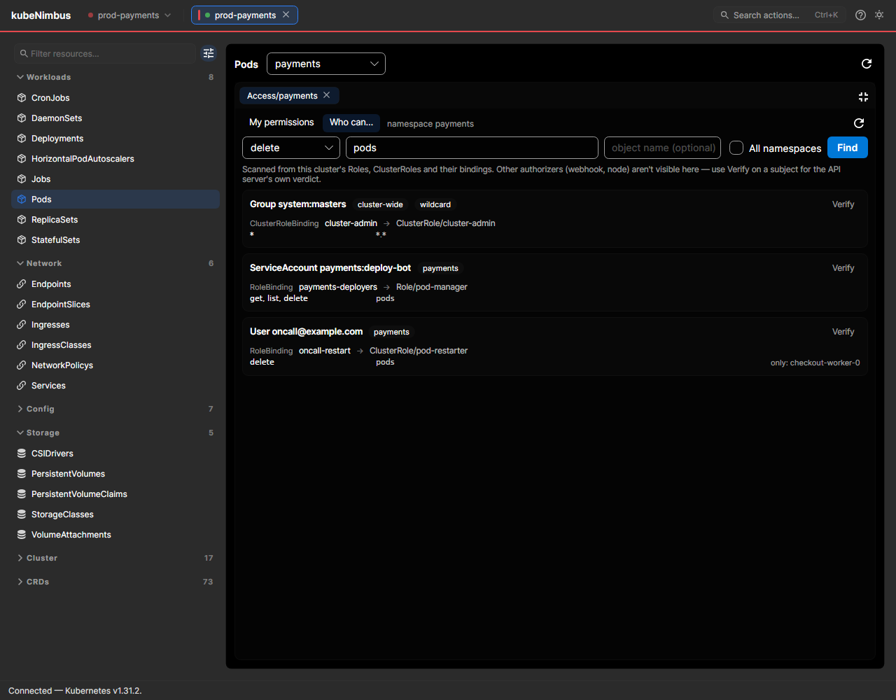
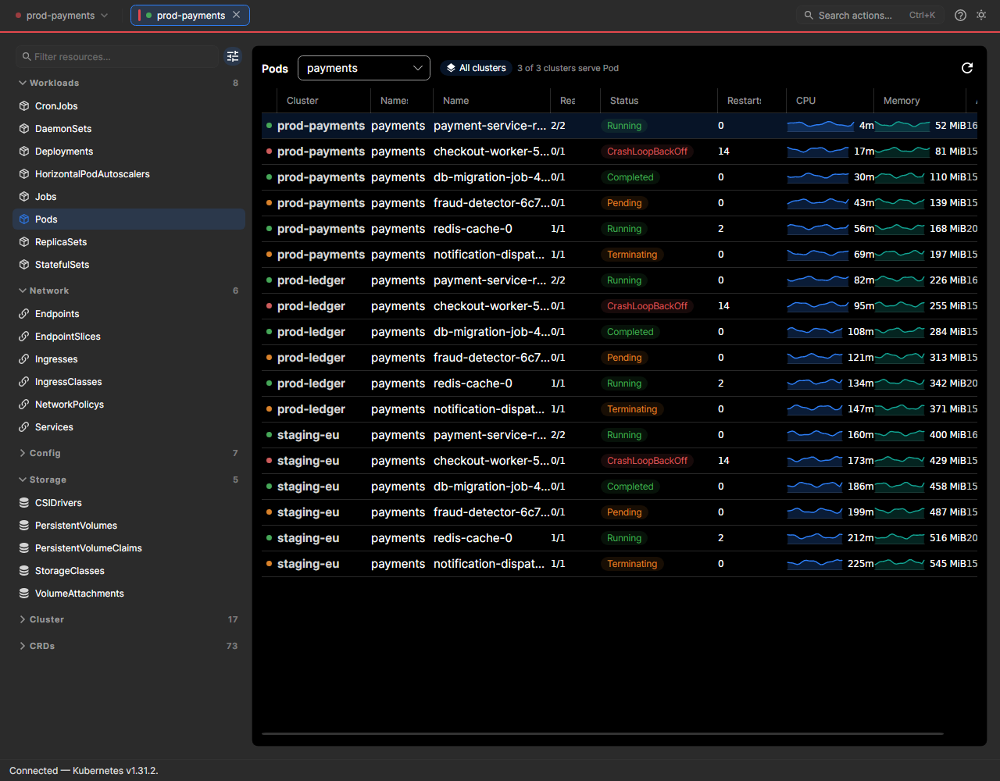
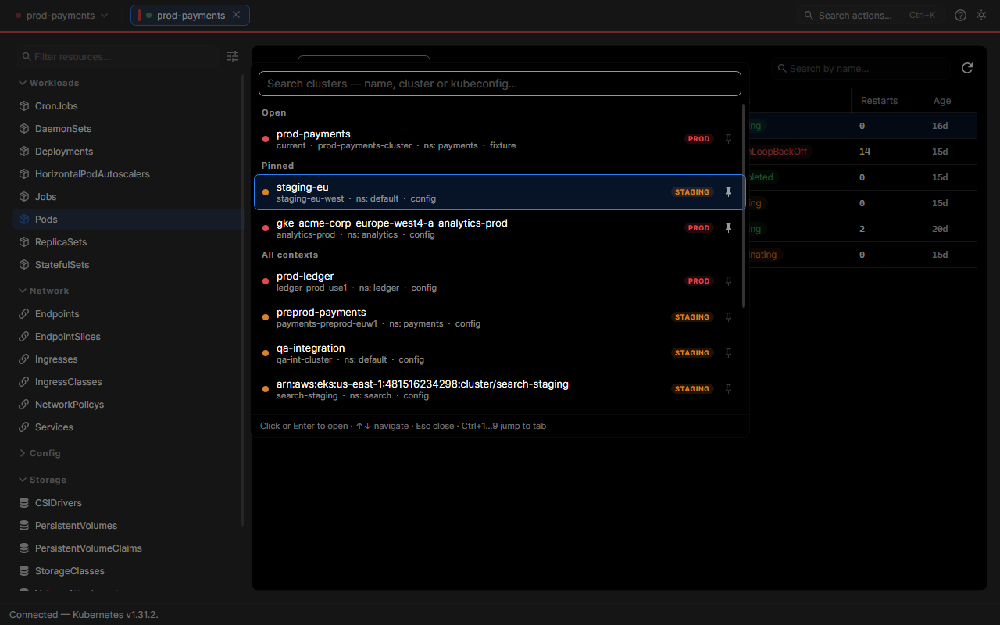

<p align="center">
  <picture>
    <source media="(prefers-color-scheme: dark)" srcset="design/masters/logo/wordmark-dark.png">
    
  </picture>
</p>

<h1 align="center">kubeNimbus</h1>

<p align="center">
  A fast, open-source Kubernetes desktop client.<br>
  The Kubernetes sibling of <a href="https://github.com/Shman4ik/pgNimbus">pgNimbus</a>, and an alternative to Lens.
</p>

<p align="center">
  <a href="https://github.com/Shman4ik/kubeNimbus/actions/workflows/ci.yml"></a>
  <a href="https://github.com/Shman4ik/kubeNimbus/releases/latest"></a>
  <a href="LICENSE"></a>
  
  
</p>

---

> **Why another one?** The 2026 Kubernetes GUI market is thin in one specific
> place. Lens is subscription-gated for commercial use and heavy Electron;
> OpenLens is dead; FreeLens is still Electron, and so is Headlamp's desktop
> app; Aptakube is polished but closed and paid; k9s is a keyboard TUI.
> [KubeUI](https://github.com/IvanJosipovic/KubeUI) is the closest thing to
> kubeNimbus — also MIT, also Avalonia — and is the comparison worth making:
> kubeNimbus is NativeAOT, opens in ~150 ms rather than ~650 ms, ships a ~62 MB
> payload rather than 382 MiB, and sends no telemetry at all.

## Screenshots

<p align="center">
  <picture>
    <source media="(prefers-color-scheme: dark)" srcset="design/screenshots/workloads-list.dark.png">
    
  </picture>
</p>

<table>
  <tr>
    <td width="50%"><br><sub><b>Pod detail</b> docks along the bottom — full-width logs, not a cramped sidecar.</sub></td>
    <td width="50%"><br><sub><b>YAML editing</b> with syntax highlighting and server-side apply.</sub></td>
  </tr>
  <tr>
    <td width="50%"><br><sub><b>Who can do X?</b> — every subject a binding grants a verb, verifiable against the API server.</sub></td>
    <td width="50%"><br><sub><b>All clusters</b> — one list across the whole fleet, honest about partial coverage.</sub></td>
  </tr>
  <tr>
    <td width="50%"><br><sub><b>Cluster switcher</b> (Ctrl/Cmd+P) — fuzzy search over every context, pinned favourites, and prod/staging/dev colour so you always know where you are.</sub></td>
    <td width="50%"></td>
  </tr>
</table>

<sub>Rendered from the repo's own headless harness (`tools/Screenshot`) against
fixture data — real views, synthetic clusters.</sub>

## Download

Grab the archive for your platform from the
[latest release](https://github.com/Shman4ik/kubeNimbus/releases/latest).
Builds are self-contained NativeAOT binaries — **no .NET runtime to install**.

| Platform | Archive |
|---|---|
| Windows x64 | `kubeNimbus-<version>-win-x64.zip` |
| Linux x64 | `kubeNimbus-<version>-linux-x64.tar.gz` |
| Linux arm64 | `kubeNimbus-<version>-linux-arm64.tar.gz` |
| macOS Apple Silicon | `kubeNimbus-<version>-osx-arm64.tar.gz` |

Intel Macs aren't published yet — [build from source](#building-from-source),
it's one command.

**The binaries are unsigned.** Code signing needs certificates this project
doesn't have, so your OS will object the first time:

<details>
<summary><b>Windows</b></summary>

Unblock the zip before extracting (Properties → Unblock), or run
`Unblock-File kubeNimbus-<version>-win-x64.zip` in PowerShell. Extract and run
`kubeNimbus.exe`. SmartScreen will show "Windows protected your PC" — click
**More info → Run anyway**.
</details>

<details>
<summary><b>Linux</b></summary>

```bash
tar -xzf kubeNimbus-<version>-linux-x64.tar.gz
cd kubeNimbus-<version>-linux-x64
./kubeNimbus
```

Needs a desktop session (X11, or Wayland via XWayland). On a minimal image you
may need `libx11-6`, `libsm6`, `libice6` and `fontconfig`.
</details>

<details>
<summary><b>macOS</b></summary>

```bash
tar -xzf kubeNimbus-<version>-osx-arm64.tar.gz
cd kubeNimbus-<version>-osx-arm64
xattr -dr com.apple.quarantine .
./kubeNimbus
```

Gatekeeper quarantines downloaded unsigned binaries; the `xattr` line clears
it. This build is a plain executable, not an `.app` bundle yet, so launch it
from a terminal.
</details>

<details>
<summary><b>Verifying the download</b></summary>

Every release ships `SHA256SUMS.txt`:

```bash
sha256sum -c SHA256SUMS.txt --ignore-missing     # shasum -a 256 -c on macOS
```
</details>

Then point it at a cluster — kubeNimbus reads your `$KUBECONFIG` chain and
`~/.kube/config` and lists what it finds. If neither turns anything up, the
first screen has an **Open kubeconfig file…** button: pick the file and it's
added. Only the *path* is remembered — the file is re-read through the normal
kubeconfig chain every time, so nothing is ever copied into app storage.

> **Note on `$KUBECONFIG`:** an app launched from Explorer, Finder or a
> shortcut doesn't inherit environment variables set in your shell. That's
> what the file picker is for; kubeNimbus also tells you exactly which paths
> it searched.

### No cluster yet? Try the demo

The same first screen has **Explore demo cluster** (also `Ctrl`/`Cmd`+`K` →
"Explore the demo cluster"). It opens a full sample workload set that ships
inside the binary — pods in every interesting state, live-looking logs,
environment variables and secrets, events, usage graphs, Helm releases and a
realistic CRD catalog — with **no cluster, no credentials and no network
involved**. It's there so you can see what the app does before wiring
anything up.

It is labelled as sample data throughout: the tab reads *Demo cluster*, and a
banner sits above the content for as long as the tab is open. Exec,
port-forward and applying/deleting YAML genuinely need a real API server, so
those panes say so instead of pretending; everything else is the real UI over
sample objects.

## What it does

**Connect** — every `$KUBECONFIG` entry plus `~/.kube/config`, with
exec-plugin auth (EKS, GKE, AKS) resolved through the kubeconfig at connect
time. Multi-cluster tabs, drag-reorderable, restored with your workspace.
**Credentials are never persisted** — see [SECURITY.md](SECURITY.md).

**Browse** — a discovery-driven sidebar covering built-in kinds *and* CRDs,
filterable by name, API group or `kubectl` short name (`svc`, `po`), with a
pinned Recent section. Lists are informer-style **list + watch**, so they
update live rather than polling, and reconnect on their own with
resourceVersion resume and a relist on 410 Gone.

**Inspect** — pod detail docks along the bottom, full width: live logs with
follow, search, severity colouring and a previous-container fetch; environment
variables with per-key on-demand reveal for Secret and ConfigMap refs; events
as a card feed; owner-chain navigation from pod to replica set to deployment.
**Exec** into a container and **port-forward**, both over websockets.

**Edit** — YAML view and edit for any resource with syntax highlighting,
server-side apply through a field manager, conflicts surfaced with a
force-apply offered, and a two-step delete.

**Measure** — live CPU and memory from `metrics.k8s.io` in the list and per
container, plus usage graphs over the session's rolling 30-minute window. A
cluster with no metrics-server simply hides those columns instead of erroring.

**Operate** — read-only Helm release browsing (values, rendered manifest,
notes, revision history) read straight from release Secrets with no Helm binary
involved; and RBAC access review in all three directions: your effective
permissions via `SelfSubjectRulesReview`, where a ServiceAccount's access comes
from, and cluster-wide **who can do X** with one-click `SubjectAccessReview`
confirmation.

**Fleet** — an "All clusters" toggle aggregating any kind across every
connected cluster into one list, with a Cluster column and an honest
"n of m clusters serve X" when a kind isn't available everywhere.

**Switch** — a Ctrl/Cmd+P cluster switcher that fuzzy-searches every context by
name, cluster or kubeconfig file, so a 200-entry kubeconfig full of generated
EKS ARNs is three keystrokes away rather than a scroll. Pin the clusters you
live in. Every cluster is colour-coded prod / staging / dev — a red band sits
under the command bar whenever you're pointed at production, and you can correct
the guess by right-clicking a tab.

Plus a Ctrl/Cmd+K command palette, an F1 shortcut cheat sheet, and light/dark
themes.

Full detail, including *why* each piece is built the way it is, lives in
[CLAUDE.md](CLAUDE.md). Release history is in [CHANGELOG.md](CHANGELOG.md).

## Known limitations

kubeNimbus is **pre-1.0**, and the first public release is honest about where
it's been exercised:

- Binaries are unsigned (see above).
- Windows has had the most hands-on use. The Linux and macOS builds are
  produced and AOT-verified by CI but have seen much less real-world testing.
- The demo cluster is a fixed sample set, not a simulator: nothing in it
  changes, scales or can be edited, and exec/port-forward/apply/delete are
  unavailable there by nature. It's for seeing the app, not for practising
  against.
- Helm is read-only — install, upgrade and rollback stay Helm's job.
- Usage history is session-scoped and capped at 30 minutes **by design**.
  Long-range metrics is Prometheus's job, and a permanent non-goal here.

**Permanent non-goals:** cluster provisioning, in-cluster agents, and
telemetry. kubeNimbus makes no network connection other than to the clusters
you point it at.

Bugs and gaps are worth reporting — the
[issue templates](https://github.com/Shman4ik/kubeNimbus/issues/new/choose)
ask for the two things that make a Kubernetes-client bug tractable.

## Tech stack

- **.NET 10**, with **NativeAOT** as the shipping configuration — not an
  afterthought. Every dependency is chosen to survive trimming and AOT.
- `KubernetesClient.Aot` (source-generated serialization) as the only cluster
  dependency in the engine.
- [Avalonia 12](https://avaloniaui.net/) — Fluent theme, Inter, DataGrid,
  AvaloniaEdit — with `CommunityToolkit.Mvvm` and compiled bindings only.
- [TUnit](https://tunit.dev/) on Microsoft.Testing.Platform, run against a
  **real cluster** rather than mocks.

### Architecture

| Project | |
|---|---|
| `src/KubeNimbus.Core` | The engine: kubeconfig, `ClusterClient` (discovery, watch, logs, exec, port-forward, apply, metrics, Helm, RBAC). **Zero UI dependencies** — reusable for a future CLI. |
| `src/KubeNimbus.App` | The Avalonia desktop shell. |
| `tests/KubeNimbus.Core.Tests` | TUnit integration tests against a live cluster; they skip cleanly without one. |
| `tools/Screenshot` | Headless visual-verification harness — renders real views to PNG with no display. Dev-only. |

## Building from source

Requires the [.NET 10 SDK](https://dotnet.microsoft.com/download/dotnet/10.0).

```bash
git clone https://github.com/Shman4ik/kubeNimbus.git
cd kubeNimbus
dotnet build KubeNimbus.slnx
dotnet run --project src/KubeNimbus.App
```

For a release-shaped binary (needs a native toolchain — MSVC on Windows,
`clang` + `zlib1g-dev` on Linux, Xcode CLT on macOS):

```bash
dotnet publish src/KubeNimbus.App -c Release -r linux-x64 -p:PublishAot=true -o publish/app
```

### A cluster to try it against

`scripts/sandbox-up` spins up a throwaway single-node k3s cluster in Docker,
preloaded with demo workloads picked to light up every part of the UI — healthy
and deliberately-broken pods, CRDs, Helm releases, RBAC subjects, PVCs, and
jobs that keep firing so the live watch is visibly live:

```bash
./scripts/sandbox-up.sh                     # sandbox-up.ps1 on Windows
export KUBECONFIG=.sandbox/kubeconfig.yaml
dotnet run --project src/KubeNimbus.App
```

The same kubeconfig is what the integration tests auto-discover. Flags — a
second cluster for the fleet views, custom port, bare cluster — are in
[scripts/README.md](scripts/README.md); tear down with `./scripts/sandbox-down.sh`.

## Contributing

Contributions are welcome. [CONTRIBUTING.md](CONTRIBUTING.md) covers the setup,
what to verify before opening a PR, and the handful of rules a change is most
likely to trip over. [CLAUDE.md](CLAUDE.md) is the full engineering contract
and the best thing to read first.

Security issues go through
[private reporting](https://github.com/Shman4ik/kubeNimbus/security/advisories/new),
not the issue tracker — see [SECURITY.md](SECURITY.md).

By participating you agree to the
[Code of Conduct](CODE_OF_CONDUCT.md).

## License

[MIT](LICENSE) — free for commercial use, no subscription, no seat count.
